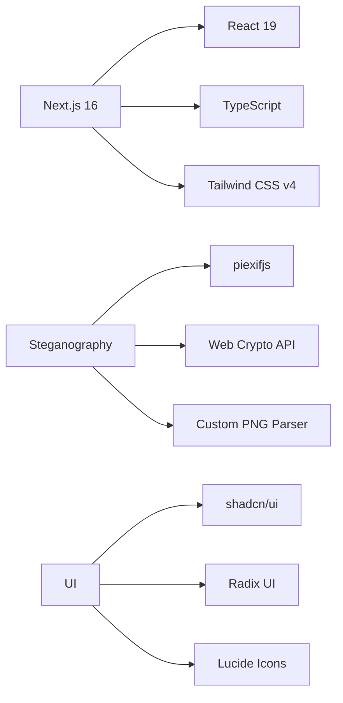

# 🔐 Steganography Web Application
<div align="center">


### *Hide secrets within images — Modern, Secure, Browser-Based*

[🚀 Live Demo](#) • [📖 Documentation](#-usage) • [🤝 Contributing](#-contributing)


</div>

---

## ✨ Features

<table>
<tr>
<td width="33%" align="center">

### 🎯 EXIF Metadata  
Hide text inside EXIF fields  
<sub>UserComment • ImageDescription • Artist • Copyright</sub>

</td>
<td width="33%" align="center">

### 🔒 LSB Encryption  
Embed files via pixel manipulation  
<sub>AES-CFB • Password Protected • Binary Support</sub>

</td>
<td width="33%" align="center">

### 📝 PNG Metadata  
Store text inside PNG tEXt chunks  
<sub>UTF-8 Support • Multiple Fields • Lossless</sub>

</td>
</tr>
</table>

---

## 🛡️ Security & Privacy

<div align="center">

| Feature | Description |
|--------|-------------|
| 🔐 **AES-CFB Encryption** | Strong encryption for LSB method |
| 🔑 **SHA-256 Key Derivation** | Secure password-based key |
| 💻 **Client-Side Processing** | No uploads — fully local |
| 📦 **Binary Support** | Hide any file type |
| 🎨 **Lossless PNG Output** | Preserves visual quality |

</div>

---

## 🚀 Quick Start

### Requirements
```
Node.js 18+ • npm / yarn / pnpm • Modern Browser
```

### Installation

```bash
git clone https://github.com/rizkidsaputra/steganography-web.git
cd steganography-web
npm install
npm run dev
# Open http://localhost:3000
```

---

## 📖 Usage

### 🔽 Embedding Data
1. Masuk ke halaman **Embed**
2. Pilih metode: EXIF / LSB / PNG Metadata
3. Upload gambar (JPG, PNG, WebP)
4. Isi teks atau unggah file
5. Atur opsi (password untuk LSB, field untuk EXIF/PNG)
6. Klik **Embed & Download**

### 🔼 Extracting Data
1. Masuk ke halaman **Extract**
2. Pilih metode sesuai gambar
3. Upload gambar yang berisi data tersembunyi
4. Masukkan password jika dibutuhkan
5. Klik **Extract Data**

---

## 🛠️ Technology Stack

<div align="center">



</div>

| Category | Technologies |
|----------|-------------|
| **Framework** | Next.js 16 (App Router) |
| **Language** | TypeScript |
| **Styling** | Tailwind v4 |
| **Components** | shadcn/ui • Radix UI |
| **Icons** | Lucide React |
| **Steganography** | piexifjs • Web Crypto API • Custom PNG parsing |

---

## 📁 Project Structure

```
steganography-web/
│
├── app/
│   ├── dashboard/
│   ├── embed/
│   ├── extract/
│   ├── about/
│   ├── layout.tsx
│   ├── page.tsx
│   └── globals.css
│
├── components/
│   ├── navbar.tsx
│   ├── footer.tsx
│   ├── dashboard-card.tsx
│   ├── method-selector.tsx
│   └── ui/
│
├── src/utils/
│   ├── exifSteg.js
│   ├── lsbSteg.js
│   └── pngMetaSteg.js
│
├── public/
├── README.md
├── LICENSE
└── package.json
```

---

## 🔬 How It Works

### 📷 EXIF Method
- Embed data ke EXIF JPEG/PNG  
- **Pro:** mudah, kualitas terjaga  
- **Con:** kapasitas kecil, mudah terdeteksi

### 🎨 LSB Method
- Simpan bit data dalam pixel RGB  
- Mendukung **file**, **AES-CFB**, **password**  
- Output otomatis PNG untuk menjaga bit

### 🖼️ PNG Metadata Method
- Simpan teks dalam tEXt chunks  
- Lossless & tidak merusak struktur gambar

---

## 🤝 Contributing

```bash
git checkout -b feature/AmazingFeature
git commit -m "Add AmazingFeature"
git push origin feature/AmazingFeature
```

**Contribution Ideas**
- Metode baru (DCT / DWT / F5)
- UI/UX upgrades
- Dokumentasi
- Internationalization
- Automated testing

---

## 👥 Authors

<div align="center">

<table>
<tr>
<td align="center" width="50%">
<a href="https://github.com/rizkidsaputra">
<br/>
<b>Rizki D. Saputra</b>
</a><br/>
<sub>Core Developer</sub>
</td>
<td align="center" width="50%">
<a href="https://github.com/JonatannaelPanjaitan">
<br/>
<b>Jonatannael Panjaitan</b>
</a><br/>
<sub>Core Developer</sub>
</td>
</tr>
</table>

</div>

---

## ⚠️ Disclaimer

<div align="center">

**For educational and research use only.**  
Semua proses dilakukan **sepenuhnya di browser**, tanpa server.

</div>

---

<div align="center">

### ⭐ Jika project ini bermanfaat, jangan lupa beri star!

Made with ❤️ by  
**[Rizki D. Saputra](https://github.com/rizkidsaputra)** & **[Jonatannael Panjaitan](https://github.com/JonatannaelPanjaitan)**

</div>
